# SRS Agent - System Architecture Diagram Generator

## 🏗️ **Overview**
The SRS (System Requirements Specification) Agent generates comprehensive system architecture diagrams from system requirements using AI. It creates Mermaid diagrams showing system components, data flows, and technology stack.

## 📁 **Files Created:**
- `backend/agents/srs_agent.py` - Main SRS agent implementation
- `backend/test_srs_agent.py` - Test script for the agent
- Updated `backend/main.py` - Added `/api/generate_architecture` endpoint

## 🚀 **API Endpoint**

### **POST `/api/generate_architecture`**

**Request Body:**
```json
{
  "requirements": "System requirements description...",
  "technology_stack": "Optional technology stack info",
  "deployment_type": "web|mobile|desktop|microservices"
}
```

**Response:**
```json
{
  "architecture_diagram": "mermaid diagram code",
  "component_summary": "Summary of system components",
  "status": "success"
}
```

## 🔧 **Usage Examples**

### **Example 1: E-commerce Platform**
```bash
curl -X POST http://127.0.0.1:5000/api/generate_architecture \
  -H "Content-Type: application/json" \
  -d '{
    "requirements": "Build an e-commerce platform with user management, product catalog, shopping cart, payment processing, and admin dashboard.",
    "technology_stack": "React, Node.js, PostgreSQL, Redis, Docker, AWS",
    "deployment_type": "web"
  }'
```

### **Example 2: Blog Application**
```bash
curl -X POST http://127.0.0.1:5000/api/generate_architecture \
  -H "Content-Type: application/json" \
  -d '{
    "requirements": "A blog application with user authentication, post creation, comments, and admin panel.",
    "deployment_type": "web"
  }'
```

### **Example 3: Microservices Architecture**
```bash
curl -X POST http://127.0.0.1:5000/api/generate_architecture \
  -H "Content-Type: application/json" \
  -d '{
    "requirements": "A microservices-based application with user service, order service, payment service, and notification service.",
    "technology_stack": "Docker, Kubernetes, Node.js, MongoDB, Redis, RabbitMQ",
    "deployment_type": "microservices"
  }'
```

## 🧪 **Testing**

### **Run the Test Script:**
```bash
cd backend
python test_srs_agent.py
```

### **Manual Testing:**
1. Start the Flask server: `python main.py`
2. Use the test script or curl commands above
3. View generated diagrams at: https://mermaid.live/

## 🎯 **Features**

### **Generated Diagrams Include:**
- ✅ System components (frontend, backend, database)
- ✅ Data flow between components
- ✅ Technology stack labels
- ✅ External integrations and APIs
- ✅ User interaction flows
- ✅ Security layers and authentication
- ✅ Deployment architecture

### **Supported Deployment Types:**
- `web` - Traditional web applications
- `mobile` - Mobile applications
- `desktop` - Desktop applications
- `microservices` - Microservices architecture

## 🔍 **Agent Configuration**

### **AI Model:** OpenAI GPT-4o
### **Input Schema:**
```python
class SystemRequirements(BaseModel):
    requirements: str
    technology_stack: str = ""
    deployment_type: str = "web"
```

### **Output Schema:**
```python
class ArchitectureOutput(BaseModel):
    architecture_diagram: str
    component_summary: str
```

## 📊 **Example Output**

### **Architecture Diagram (Mermaid):**

```mermaid
graph TB
    User[👤 User] --> Frontend[🖥️ React Frontend]
    Frontend --> API[🔗 REST API Gateway]
    API --> Auth[🔐 Authentication Service]
    API --> Product[📦 Product Service]
    API --> Order[🛒 Order Service]
    Product --> DB[(🗄️ PostgreSQL)]
    Order --> DB
    Auth --> Redis[(⚡ Redis Cache)]
```


### **Component Summary:**
```
System Components:
- Frontend: React-based user interface
- Backend: Node.js REST API services
- Database: PostgreSQL for data persistence
- Cache: Redis for session management
- Authentication: JWT-based auth service
```

## 🛠️ **Integration with Frontend**

The frontend can integrate with this agent by:

1. **Adding a new page** for system architecture generation
2. **Creating a form** to input requirements
3. **Displaying the generated diagram** using Mermaid.js
4. **Showing component summary** alongside the diagram

## 🔧 **Configuration**

### **Environment Variables:**
- `OPENAI_API_KEY` - Required for AI functionality
- Set in `config.py` or environment

### **Dependencies:**
- `pydantic-ai==0.0.36` - AI agent framework
- `openai` - AI model access

## 🚀 **Deployment**

The SRS agent is automatically available when deploying the backend:

1. **Local Development:** `python main.py`
2. **Docker:** Included in docker-compose.yml
3. **Railway:** Deployed with the main application

## 📈 **Future Enhancements**

- [ ] Support for different diagram types (sequence, flowcharts)
- [ ] Integration with popular architecture tools
- [ ] Export to different formats (PNG, SVG, PDF)
- [ ] Real-time collaboration features
- [ ] Template-based architecture generation

The SRS Agent is now ready to generate comprehensive system architecture diagrams from requirements! 🎉
